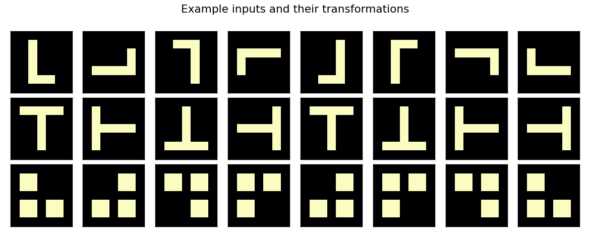
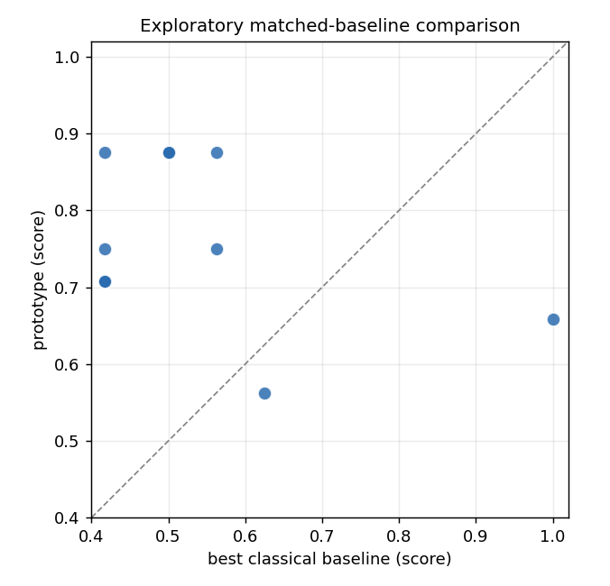
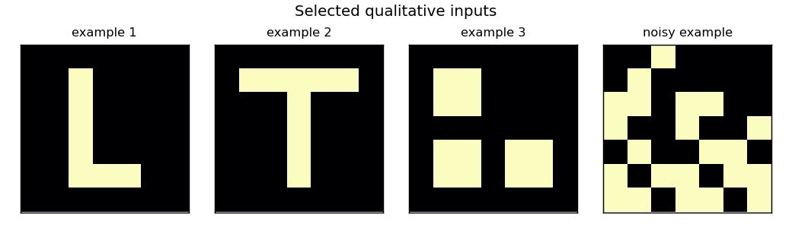

# QEGK: Entangled Group-Equivariant Quantum Kernels

A simulator-based research prototype studying group-equivariant quantum kernels
for small-image anomaly and symmetry tasks, compared against matched classical
kernels under low-data conditions.

<p align="center">
  
</p>

> Exploratory simulator-based research prototype. No quantum-advantage claim.

## What this explores

Whether averaging a quantum fidelity kernel over a small set of input
transformations helps on symmetry-heavy, low-data image tasks, relative to
standard classical kernels (RBF, polynomial, cosine, random Fourier features).
Everything runs on a classical simulator at small scale.

## Selected visuals

<p align="center">
  
</p>

*Exploratory matched-baseline comparison under low-data conditions (simulator).
Each point is one task; the dashed line is parity. Results are mixed.*

<p align="center">
  
</p>

*Selected qualitative example inputs.*

## How to run

```bash
python -m venv .venv
source .venv/bin/activate
pip install -r requirements.txt

python scripts/run_all_experiments.py --quick
pytest -q
```

## Honest status

- This is an exploratory research prototype.
- Results are simulator-based.
- No quantum advantage is claimed.
- No state-of-the-art claim is made.
- Some classical baselines match or outperform the prototype.
