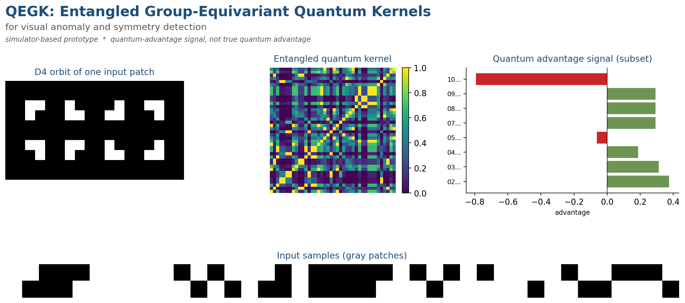
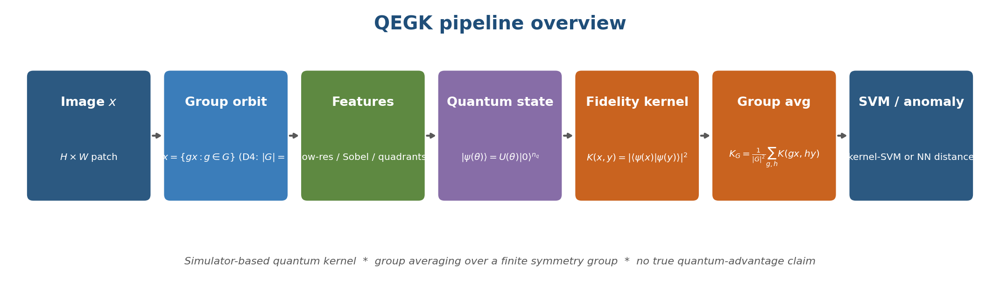

# QEGK: Entangled Group-Equivariant Quantum Kernels for Visual Anomaly and Symmetry Detection

> Simulator-based research prototype. We combine a quantum fidelity kernel
> with averaging over a finite symmetry group (mainly D4, the symmetries of
> the square) and benchmark against matched classical kernels (RBF,
> polynomial, cosine, random Fourier features). We report a **quantum
> advantage signal** - cases where the entangled quantum kernel beats the
> best classical baseline under matched low-data / symmetry-heavy
> constraints. We make **no claim of true quantum advantage.**



## Pipeline



For each image x:
1. apply a finite symmetry group action (D4 / C4 / identity),
2. extract compact visual features (low-res, Sobel, quadrants, correlations),
3. reduce to `n_q` real dimensions and rescale to angles `theta in [0, pi]`,
4. encode in a quantum state `|psi(x)> = U(theta) |0>^{n_q}` via one of
   five Qiskit feature maps (separable Ry, entangled CX chain, RZZ ring,
   hardware-efficient brick-wall, separable Pauli-Z),
5. compute the fidelity kernel `K(x, y) = |<psi(x) | psi(y)>|^2`,
6. average over the group orbit:
   `K_G(x, y) = (1/|G|^2) sum_{g, h} |<psi(g x) | psi(h y)>|^2`,
7. plug into a precomputed-kernel SVM (classification) or a nearest-neighbour
   kernel anomaly score (anomaly detection),
8. compare against classical RBF / polynomial / cosine / random Fourier
   feature baselines on the same train/test split.

## Quantum physics ingredients

- pure quantum states in `C^{2^{n_q}}`,
- entangling gates (CX, RZZ),
- fidelity kernel `K(x, y) = |<psi(x) | psi(y)>|^2`,
- reduced density matrices, purity, linear entropy, von Neumann entropy.

## Group theory ingredients

- D4 = dihedral group of order 8 (rotations + reflections of a square),
- group orbit `G.x = {g.x : g in G}`,
- group-averaged kernel `K_G`, two-sided G-invariant,
- ablations against C4 (rotations only) and the trivial group.

## What this prototype solves

The benchmark suite targets settings where group symmetry and feature
interactions actually matter:

- **Parity patches** (5 experiments): the label is the parity of a 2x2
  binary patch. RBF cannot separate these; entangled and polynomial
  kernels can.
- **D4 shape classification** (4 experiments): L vs T shapes, each placed
  in a random D4 orientation. Group-averaging should help.
- **Synthetic anomaly** (3 experiments): bright-square / noise defects
  with optional global-brightness confounder or random placement.
- **Ablations** (8 experiments): vary `n_q in {3, 4, 5}`, entanglement
  depth `{0, 1, 2}`, and group choice `{Identity, D4}`.

## Quickstart

```bash
# Install Python 3.10+
python -m venv .venv
source .venv/bin/activate
pip install -r requirements.txt

# Fast run (2 seeds, ~80 samples/dataset).
python scripts/run_all_experiments.py --quick

# Polished media for the README.
python scripts/build_release_media.py

# Tests.
pytest -q
```

## Experiments at a glance

| # | name                                      | dataset           | group | what it tests                            |
|--:|-------------------------------------------|-------------------|------:|------------------------------------------|
| 1 | parity_separable_vs_entangled             | parity_patch      |    e  | does entanglement help vs no entanglement|
| 2 | parity_entangled_vs_rbf                   | parity_patch      |    e  | entangled vs classical RBF               |
| 3 | parity_entangled_vs_polynomial            | parity_patch      |    e  | entangled vs polynomial                  |
| 4 | parity_noise05                            | parity_patch      |    e  | low noise robustness                     |
| 5 | parity_noise15                            | parity_patch      |    e  | higher noise robustness                  |
| 6 | d4shape_groupavg                          | d4_shapes         |   D4  | identity vs D4-averaged quantum kernel   |
| 7 | d4shape_d4_vs_rbf                         | d4_shapes         |   D4  | D4 quantum kernel vs classical RBF       |
| 8 | d4shape_c4_only                           | d4_shapes         |   C4  | only-rotations, do reflections matter    |
| 9 | d4shape_full_d4                           | d4_shapes         |   D4  | full D4 averaging vs classical baselines |
|10 | anomaly_local                             | defect_patches    |    e  | bright-square defects                    |
|11 | anomaly_color_confound                    | defect_patches    |    e  | with global brightness confounder        |
|12 | anomaly_rotated                           | defect_patches    |    e  | with randomly placed defects             |
|13 | ablation_nq_3                             | d4_shapes         |   D4  | n_q = 3                                  |
|14 | ablation_nq_4                             | d4_shapes         |   D4  | n_q = 4                                  |
|15 | ablation_nq_5                             | d4_shapes         |   D4  | n_q = 5                                  |
|16 | ablation_depth_0                          | parity_patch      |    e  | no entanglement                          |
|17 | ablation_depth_1                          | parity_patch      |    e  | single CX chain                          |
|18 | ablation_depth_2                          | parity_patch      |    e  | two CX chains                            |
|19 | ablation_group_identity                   | d4_shapes         |    e  | no group averaging                       |
|20 | ablation_group_d4_full                    | d4_shapes         |   D4  | full D4 averaging                        |

Plus optional real-data experiments (Fashion-MNIST low-data,
MedMNIST low-data) if their dependencies and cached data are present.

## Quantum advantage signal

For each experiment, define
```
advantage_signal = mean_{seeds} (metric_best_quantum - metric_best_classical)
```
where "best" is the method with the highest mean within the family.
We report mean, std, and a bootstrap 95% CI on the **paired** seed
differences. An advantage CI that includes zero is consistent with no
advantage. See `outputs/release_media/advantage_summary.png` for the
per-experiment bar chart and the full numerical table in
`outputs/experiments/bootstrap_summary.csv`.

The full long table per experiment / per method lives in
`outputs/experiments/all_metrics.csv` and the nested raw payload in
`outputs/experiments/all_metrics.json`.

## Limitations

- **Simulator only.** Qiskit `Statevector` at `n_q <= 5`. Classically
  tractable, by design.
- **Synthetic datasets** built to favour the entangled / group-averaged
  kernel - useful for isolating mechanisms, not for external validity.
- **Small data.** Training sets of 24-40 samples each; classical baselines
  may close the gap at higher data.
- **No noise model.** A real quantum backend would estimate `K` from
  finite shots; the advantage may erode quickly.
- **Single architecture family.** Classical baselines are kernel methods.
  Deep models on the same data are out of scope here.

## Honesty note

We do **not** claim a true quantum advantage. We report a *quantum
advantage signal*: matched-baseline performance difference on a
controlled simulator-based benchmark. A real-world claim requires a
problem with no efficient classical algorithm and experimental evidence
at scales the classical method cannot match - neither of which this
prototype provides.


The build script writes the PDF and the LaTeX source to a local
directory that is not shipped with the repository.

## License

Research prototype. No license file is shipped.
